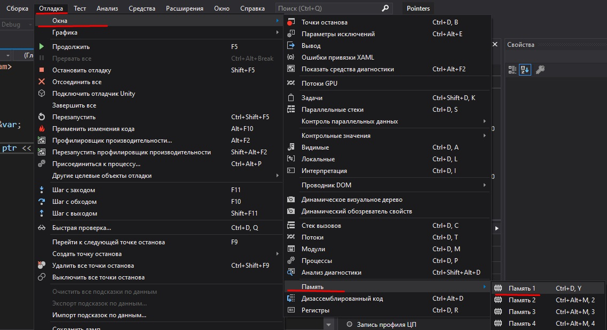
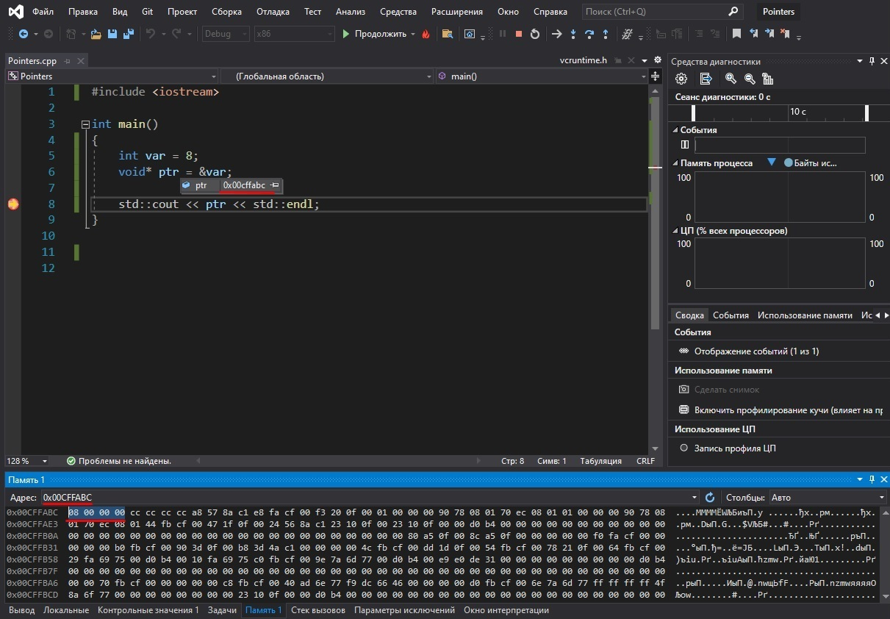
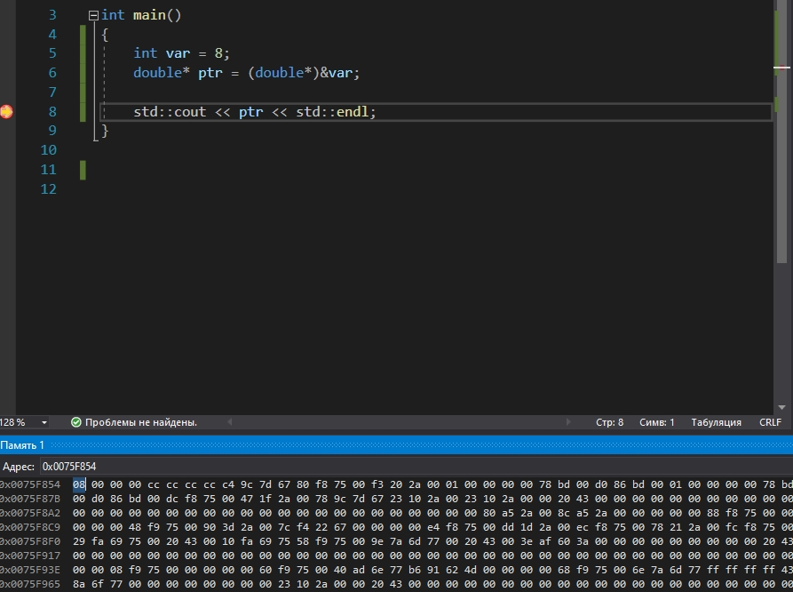
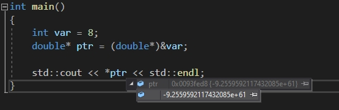
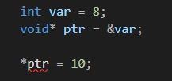
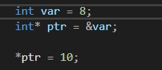

# Указатели

**Указатель** - это целое число, которое содержит адрес в памяти. Тип указателя не имеет никакого значения к самому указателю, он помогает интерпретировать те данные, на которые указывает указатель. 

Давайте напишем наш первый указатель:

```cpp
void* ptr = 0;
```

Мы используем тип ***void*** тогда, когда хотим сохранить адрес, на который указывает указатель, но не хотим никак интерпретировать эти данные.

Число 0 не является допустимым адресом памяти. Адреса памяти не сводятся к нулю, ноль недействителен, и это означает, что
этот указатель недействителен. Мы не можем читать или записывать данные по указателю, который указывает на нулевой адрес в памяти. Если мы попытаемся это сделать, 
наша программа упадёт с ошибкой.

Вместо присвоения указателю нуля, можно присвоить значение **NULL**: 

```cpp
void* ptr = NULL;
```
Это всего лишь макрос, определённый в файле vcruntime.h:

```cpp
#define NULL 0
```

В C++ 11 ввели новое ключевое слово ***nullptr***, это тоже самое, что и ***NULL***, но это удобный синтаксический сахар. 

```cpp
void* ptr = nullptr;
```

Мы написали наш первый указатель, он не имеет типа и у него нулевой адрес в памяти, он совершенно бесполезен, но всё же это указатель, и это самый простой указатель, который возможно написать.

Давайте сделаем что-то полезное и создадим переменную:

```cpp
int var = 8;
```

У каждой переменной есть адрес в памяти, потому что нам нужно место, куда мы её сохраним. Чтобы узнать её адрес, необходимо поставить оператор ***&*** перед именем переменной:

```cpp
void* ptr = &var;
```

Если мы выведим этот указатель в консоль, то увидим, что это всего лишь целое шестнадцатиричное число:

```cpp
std::cout << ptr << std::endl;
```

Давайте поставим точку останова на этой строке и запустим приложение в режиме отладки, после чего откроем окно отладки памяти. Это представление показывает всей памяти внутри нашего приложения.



Наведём курсор на указатель и скопируем адрес. Вставим его в поле ***Адрес*** окна отладки памяти и нажмём ***Enter***. Теперь мы видим, что по этому адресу в памяти записано число 8, так как мы создали переменную **var** и установили её значение равное 8.  



Мы ничего не изменим, если поменяем тип указателя с ***void*** на ***int***, поскольку этот указатель, как и прежде, хранит целое число, являющееся указателем на адрес в памяти. Если мы скопируем этот адрес и посмотрим в окне отладки, то убедимся в том, что ничего не изменилось. 

```cpp
int* ptr = &var;
```

Мы даже можем привести тип указателя к типу ***double***

```cpp
double* ptr = (double*)&var;
```

Если мы скопируем и вставим адрес в окно отладки, то увидим, что это по-прежнему переносит нас туда, где записано значение нашей переменной



Тип указателя не имеет значения, но он полезен для манипулирования этой памятью, потому что компилятор будет знать, что это целое число должно состоять из 4-x байтов и мы сможем корректно его прочитать.\
Вот что будет, если тип будет указан неправильно: 



Это происходит потому, что, в среднем, размер ***double***, составляет 8 байт, а размер ***int*** 4 байта. Мы считываем 4 лишних байта и неправильно интерпретируем те данные, которые на самом деле лежат по этому адресу в памяти.

Если мы поставим оператор * перед именем переменной, содержащей указатель, то сможем получить доступ к данным, на которые он указывает. Эта операция называется ***операцией разыменования указателя***

```cpp
int* ptr = &var;

std::cout << *ptr << std::endl;
```

Если мы попробуем присвоить новое значение через указатель, у которого нет типа, то получим ошибку, поскольку компилятор не знает, какого размера данные нужно записать.  



Но если мы укажем тип, то и ошибка пропадёт



До этого момента мы выделяли память в стеке, давайте теперь выделим память под массив в куче и заполним его нулями

```cpp
char* buffer = new char[8];
memset(buffer, 0, 8);
```

Переменная ***buffer*** хранит указатель на начало данных в массиве. Так как указатели тоже являются переменными, они также хранятся в памяти, поэтому мы можем создать переменную-указатель, которая хранит адрес другого указателя. Вот так и появляются двойные, тройные и n-указатели.

Эта переменная является указателем на указатель, который указывает на начало массива. Она просто хранит адрес другого указателя. 

```cpp
char** ptr = &buffer;
```

После того, как мы выделили память в куче, её нужно освободить, если она нам больше не нужна. Для этого используется оператор ***delete***. Мы должна поставить после него квадратные скобки, чтобы указать компилятору, что мы удаляем массив. 

```cpp
delete[] buffer;
```